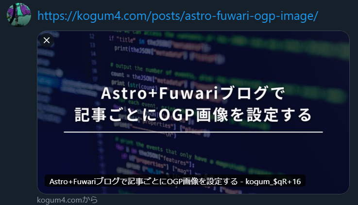

Astro＋Fuwariテンプレートでは、デフォルトだとサイト全体で共通のバナー画像がOGPに設定され、記事ごとの画像を使う仕組みがありません。SNSシェア時に記事に合わせた画像を表示させたい場合は、独自に実装を追加する必要があります。

本記事では、各記事のMarkdownのフロントマター`image: `に設定した画像パスを絶対URLに変換し、OGP画像の`meta`タグに設定されるようにする方法を解説します。Astroは内部でviteを通じて画像最適化（リサイズやフォーマット最適化など）を行うため、実装に一工夫が必要になります。

Fuwariテンプレートについての詳細が知りたい方は[以前の記事](https://kogum4.com/posts/astro-fuwari-vercel-blog/)をご参照ください。

## 実装の概要
1. **投稿フォルダ内の画像をビルド時に収集**  
   Astro/Viteの`import.meta.glob`を用いて、`/src/content/posts`以下にある画像ファイルをすべてビルド時にインポートします。これにより、**各画像の最適化後URL**を一括管理できます。
   ```js
   // 例: .png, .jpg, .jpeg, .webp を対象に収集
    const images: Record<string, string | { src: string }> = import.meta.glob(
      '/src/content/posts/**/*.{png,jpg,jpeg,webp}', 
      { import: 'default', eager: true }
    );
   ```
   上記のimagesオブジェクトにはキーに各画像の絶対パス、値に画像の最適化結果が格納されます。Astroは内部で画像最適化を行うため、`import.meta.glob`＋`eager: true`を使うことで**全画像を事前に処理**し、後で即座に参照できる状態にしています。

2. **フロントマターで指定した画像パスを解決する関数を作成**  
次に、各Markdown記事のフロントマターで指定された画像パスを解決し、ステップ1で収集した`images`オブジェクトから対応するエントリを取り出す関数`resolveCoverImage(frontmatterImage, entryId)`を定義します​。
   - 引数`frontmatterImage`: 記事のフロントマターに記載された画像パス文字列（例: "./cover.jpg"）。これが空の場合はnullを返します。
   - 引数`entryId`: 記事エントリのID（AstroのgetCollectionで取得した各記事の識別子）。これを使って記事フォルダ名を特定します。
   ```js
    function resolveCoverImage(frontmatterImage: string, entryId: string) {
      if (!frontmatterImage) return null;

      // 記事フォルダ名を取得し、"./"を除去した画像パスを結合
      const folder = path.join('/src/content/posts', getDir(entryId));
      const resolvedPath = path.join(folder, frontmatterImage.replace(/^\.\/+/, ''));

      // パス区切りを統一（Windows対策）
      const normalizedPath = resolvedPath.replace(/\\/g, '/');

      // imagesオブジェクトからエントリを検索し、見つかればその値を返す
      return images[normalizedPath] || null;
    }
    ```
1. **画像の絶対URLを取得**  
    ```js
      // 各記事のフロントマターで定義したカバー画像パスと記事IDから、最適化済みの画像データを取得
      const coverOptimized = resolveCoverImage(entry.data.image, entry.id);

      // coverOptimized がオブジェクトの場合は .srcを利用してURL文字列を取得。そうでなければそのまま文字列として扱う
      const resolvedUrl =
        coverOptimized && typeof coverOptimized === 'object' && 'src' in coverOptimized
          ? coverOptimized.src
          : (coverOptimized as string);

      // 取得した画像パス(相対パス)を絶対URLに変換
      const bannerUrl = resolvedUrl
        ? new URL(resolvedUrl, Astro.url).href
        : '';

    ```

2. **OGPタグに記事専用の画像URLを適用**  
   各記事ページのテンプレート（例: `[...slug].astro`）で、上記関数から得た画像URL `bannerUrl`を`<meta property="og:image">`や`<meta name="twitter:image">`に設定します。

   ```html
   <meta property="og:image" content={new URL(banner, Astro.url).href} />
   <meta name="twitter:card" content="summary_large_image" />
   <meta name="twitter:image" content={new URL(banner, Astro.url).href} />
   ```

:::important
- `astro.config.mjs` の `site` プロパティに本番URLを設定しないと、OGP画像の絶対URLが正しく生成されません。
:::

## まとめ
これでMarkdownフロントマターに画像パスを書くと、自動的に記事ごとのOGP画像が設定されるようになります。今回触れたソースコード全体はGitHub上のコミット履歴​[`c014d13`](https://github.com/kogum4/fuwari-blog-test/commit/c014d1377deca48b418ddde8286efd96a35f3e9f)に掲載していますので、詳しいコード差分を確認したい方はそちらもご覧ください。

以下、Xで実際に本記事のカバー画像を表示してみた例です。




## 関連記事
- [Astro(Fuwari)＋Vercelで手軽に素敵な個人ブログを作る](https://kogum4.com/posts/astro-fuwari-vercel-blog/)
- [Astro+Fuwariブログにgiscusのコメント機能を追加する](https://kogum4.com/posts/astro-fuwari-comment-giscus/)
- Astro+Fuwariブログで記事ごとにOGP画像を設定する(本記事)